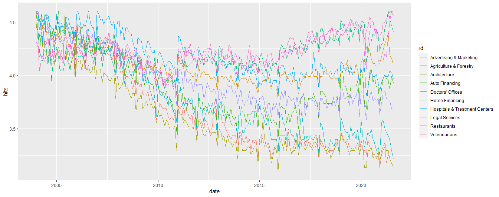
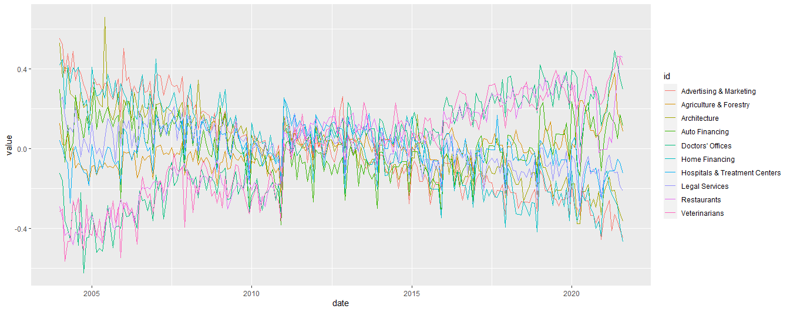

```{r, include = FALSE}
knitr::opts_chunk$set(
  collapse = TRUE,
  comment = "#>"
)
```

```{r setup}
library(knitr)
library(dplyr)
library(tibble)
library(ggplot2)
library(stringr)
```

# Einordnung
Es gibt eine große Literatur, welche Google Trends Daten in unterschiedlichen Modellen benutzt, um ökonomische Variablen zu prognostizieren. Einen ausführlichen Überblick gibt hierzu der Bericht _Big Data in der makroökonomischen Analyse_ (Kieler Beiträge zur Wirtschaftspolitik Nr. 32), Abschnitt 2.3.4. Zusammenfassend lässt sich sagen, dass die zusätzliche Verwendung von Google Trends Daten dort, wo schon andere Indikatoren vorliegen, zu keiner relevanten Verbesserung der Prognosen führt. Prognosen, welche nur auf Google Daten beruhen, schneiden aber meist ähnlich gut ab wie Prognosen, die lediglich klassische Indikatoren benutzen. Die Stärke der Google Trends Daten liegt vor allem in ihrer hohen regionalen und zeitlichen Verfügbarkeit. Dies führt unserer Ansicht nach zu drei zentralen Anwendungsfeldern für Google Daten in der Prognose:

1. Als Prognosevariablen, wenn klassische Variablen noch nicht vorliegen.
2. Als Prognosevariablen für Länder, für die sonst wenige Indikatoren vorliegen.
3. Als Echtzeitindikatoren für die wirtschaftliche Aktivität in Krisenzeiten, wenn schnell politische Entscheidungen gefällt werden müssen.

# Google-Trends Daten

## Suchanfragen

Google stellt Zeitreihen der relativen Häufigkeit eines Suchbegriffes 
in Form von [Google Trends](https://trends.google.de/trends/?geo=DE) zur Verfügung.
Hier folgt zunächst eine grundlegende Beschreibung der Daten, um dann deren statistische Besonderheiten näher zu beleuchten. 

Die Zeitreihen reichen bis 2004-01-01 zurück und können geografisch eingeschränkt werden, z.B. nach Ländern oder subnationalen Entitäten.
Hier sollte beachtet werden, dass (die Suchmaschine) Google in einigen Ländern (insbesondere in autoritär regierten Ländern wie z.B. China) nicht verfügbar ist und für diese Länder deshalb keine Daten vorhanden sind. Da die Nutzung des Internets vor allem seid 2006 stark zunahm folgen wir hier der Literatur und Google Zeitreihen ab 2006.

Bei den möglichen Suchanfragen unterschiedet man zwischen _terms_, _topics_ und _categories_.
Google definiert einen _term_ wie folgt (Google 2021a):


"Search terms show matches for all terms in your query, in the language given.

* If you search the term 'banana,' results include terms like 'banana' or 'banana sandwich'
* If you specify 'banana sandwich,' results include searches for 'banana sandwich,' as well as 'banana for lunch' and 'peanut butter sandwich'".

Die Definition eines _topic_ ist (ebd.):

"Topics are a group of terms that share the same concept in any language. Topics display below search terms.

If you search the topic 'London,' your search includes results for topics such as:
* 'Capital of the UK'
* 'Londres', which is 'London' in Spanish".

Die Eingabe eines Suchbegriffs als Topic führt also vor allem zu einer Invarianz des Suchbegriffs gegenüber der Landessprache.
Die Differenzierung zwischen Topic und Term ist aber lediglich online in der Google Suchmaske möglich.
Bei der Nutzung der R-Funktionen zum Herunterladen von Google-Daten sollte der Suchbegriff also immer in der jeweiligen Landessprache eingegeben werden. Wir unterscheiden deshalb im Folgenden nicht weiter zwischen _term_ und _topic_, sondern bezeichnen beides als _Suchbegriff_.

Um weiter zu spezifizieren, welche Daten in den Index eingehen sollen, kann bei einer Abfrage zusätzlich eine _category_ angegeben werden. Bei Google heißt es hierzu (Google 2021b):

"If you're using Trends to search for a word that has multiple meanings, you can filter your results to a certain category to get data for the right version of the word. For example, if you search for “jaguar,” you can add a category to indicate if you mean the animal or the car manufacturer."

Des Weiteren kann der Index auch nur für eine Kategorie ohne Angabe eines speziellen Suchbegriffs berechnet werden; dann gehen alle Suchanfragen, welche Google dieser Kategorie zuordnet, in den Index mit ein. Dieses Vorgehen wird im Folgenden häufiger verwendet.

## Statistische Besonderheiten

### Berechnung des Index

Der Google Trends Index ist ein relativer Index. Der Index $SVI_{ct}$ gibt den Anteil der Suchanfragen eines Suchbegriffs/Kategorie $c$ zum Zeitpunkt $t$ an der Gesamtzahl der Suchanfragen zu diesem Zeitpunkt $t$ an, normiert mit einer multiplikativen Konstanten  $C_c$ welche vom betrachteten Zeiraum abhängt, sodass das Maximum des Index im betrachteten Zeitraum bei 100 liegt (Woloszko 2020):

$$ SVI_{ct} = \frac{SV_{ct}}{SVT_t}\cdot C_c$$
Der Wert des Indexes zum Zeitpunk $t$ kann also unterschiedlich sein, je nachdem welches Zeitfenster man herunterlädt. Dies sollte bei der Arbeit mit den Daten immer beachtet werden. Insbesondere kann für frühere Zeiträume nicht der Index bis zu diesem Zeitpunkt abgeschnitten werden, sondern muss immer neu heruntergeladen werden.

###Sample
Der Index wird auf Basis eines zufällig gezogenen Samples an Suchanfragen zu einem Zeitpunkt berechnet. Dieses Sample kann sich zwischen zwei Abfragen, insbesondere an zwei verschiedenen Tagen ändern, sodass sich auch die Zeitreihe geringfügig ändern kann. Dies ist vor allem für Suchbegriffe mit einem geringen Anfragevolumen, z.B. in kleinen regionalen Einheiten relevant. Hier sollte dann eine Mehrfachziehung vorgenommen werden um einen selectin bias zu vermeiden. Da wir im folgenden Kategorienen welche durch die Vielzahl der Suchbegriffe die darunter fallen große Volumina haben und als Region Deutschland betrachten kann dieser Fehler hier vernachlässigt werden. Eine tiefergehende Analyse findet sich in Eichenauer et. al (2020).


### Allgemeiner Trend

Da die Nutzung von Google und damit auch die Anzahl verschiedener Suchbegriffe stark zugenommen hat, sinkt für jeden einzelnen Suchbegriff der relative Anteil am Gesamtsuchvolumen im Zeitverlauf (Abb. \@ref(fig:comtrend)).


Abb. \@ref(fig:trendadj) zeigt die um diesen gemeinsamen Trend bereinigten Reihen.




### Frequenz

Die Google Trends Daten können für ein Zeitfenster von 12 Monaten auf Tagesbasis abgefragt werden. Für Zeiträume bis 5 Jahre können wöchentliche Daten heruntergeladen werden. Für alle längeren Zeiträume liegen die Daten nur monatlich vor. Da wir die 12-Monatsfenster der täglichen Reihen und die 5-Jahres-Fenster der wöchentlichen Reihen beliebig wählen können, kann mit der Chow-Lin-Methode für lange Zeiträume eine Reihe auf Tagesbasis erstellt werden, welche konsistent mit den wöchentlichen und monatlichen Reihen ist. Wir folgen dabei Eichenauer et al. (2020). Dies ist in der Funktion `daily_series` (Abschnitt 3.4) implementiert.

### Strukturbruch

Im Januar 2011 wurde die regionale Erfassung der Suchanfragen geändert. Dadurch wird in regional eingeschränkten Reihen in 2011 ein Bruch sichtbar (vgl. Abb. \@ref(fig:comtrend). Auch in 2016 wurde die Methode zur Datenerhebung nochmals verändert, was auch einen Strukturbruch in den Reihen zur Folge hat. Eine einfache Methode das Problem zu umgehen ist bei der Betrachtung von Änderungsraten die betreffenden Zeiträume auszulassen. Wir wenden im Folgenden dieses Vorgehen an.
Woloszko (2020) ist nach unserem Kenntnisstand das einzige Papier, welches diese Strukturbrüche genauer adressiert.


# Funktionen

## pca

Die Funktion `pca` nimmt als Argumente mehrere Suchwörter oder Kategorien entgegen. Des Weiteren eine Region, das Start- und Enddatum (Default: 2006-01-01 und heute) sowie die Anzahl der zu berechnenden Hauptkomponenten (Default: Anzahl der Zeitreihen). Für die Zeitreihen wird hier momentan eine monatliche Frequenz angenommen.

```{r message=FALSE}
pca(keywords = c("ikea", "saturn"),
    categories = 0,
    geo = "DE",
    time = str_c("2018-01-01 ",Sys.Date()))
```

## factorR2

Für schon berechnete Faktoren `factors` aus Zeitreihen `series` ist dies eine Methode, die Erklärungskraft der Faktoren zu bestimmen. Dabei wird für jeden Faktor eine Regression auf jede Zeitreihe vorgenommen und das jeweilige $R^2$ in einer Tabelle abgetragen. Mit Wahl des Parameters `plot=TRUE` wird zusätzlich ein Barplot ausgegeben.

```{r, fig.width = 7, fig.asp = 0.8}

dat <- pca(keywords = c("ikea", "saturn", "amazon", "ebay"),
    categories = 0,
    geo = "DE",
    time = str_c("2018-08-01 ", Sys.Date()))

series <- dat %>% select(date, 6:9)
factors <- dat %>% select(date, 2:5)

factorR2(series, factors, plot = T)
```

## roll

Die Funktion `roll` dient der Erstellung von Vintages für Prognoseevaluationen. Dabei wird für jedes Datum in `start_period` bis `end` die Reihe von `start_series` als Anfang bis zu diesem Datum als Endpunkt neu heruntergeladen. Dies ist notwendig, da zu zwei Download-Zeitpunkten die ganze Google Trends Reihe verschieden sein kann. Als Funktion können Download-Funktion mit den Argumenten `keyword`, `category`, `geo`, `time` und weiteren Argumenten `...` und einem Tibble mit den Spalten `time`, `id` und `value` (Spaltennamen können auch abweichen) benutzt werden.
Zurückgegeben wird eine Liste mit einer jeweils um eine Zeiteinheit längeren Zeitreihe.
Diese kann dann z.B. mit `lapply(roll(...), f)` zur Prognoseevaluation benutzt werden, wobei `f` eine Prognose-Funktion ist.

```{r message=FALSE}
roll(keyword = c("ikea", "saturn"),
     geo = "DE",
     start_series = "2011-01-01",
     start_period = "2018-05-01",
     end = "2018-12-01",
     fun = ts_gtrends)
```

## daily_series

Für lange Zeitfenster liegen keine täglichen Daten vor, sondern nur monatliche. Die Funktion `daily_series` zieht zunächst für rollierende Zeiträume mehrere Stichproben und schätzt daraus dann mit der Chow-Lin-Methode für den ganzen Zeitraum tägliche Daten. Diese sind konsistent mit den Monatsdaten. Da momentan sehr viele Samples gezogen werden, verursacht die Funktion viele Suchanfragen bei Google, was nach einigen Malen zur vorübergehenden Sperrung der IP führt. Die Anzahl der gezogenen Fenster ist momentan unter der Anzahl aus dem Originalcode, um Anfragen zu sparen. Die dadurch hervorgerufene Abweichung scheint im Moment sehr gering bis 0 zu sein. Eine genaue Evaluation konnte jedoch wegen dem noch nicht gelösten IP-Problem noch nicht durchgeführt werden; dies steht also noch aus. 

```{r message=FALSE}
daily_series(keyword = c("arbeitslos"),
           geo = "DE",
           from = "2021-06-01")
```

## forecast_m und forecast_q

Mit der Funktion `forecast_m(r, dat, fd)` (bzw. `forecast_q(r, dat, fd)`)  kann eine Prognoseevaluation mit einer montlichen (bzw. quartalsweisen) Zielvariable durchgeführt werden. `r` ist eine Liste mit Vintages, welche mit `roll` erstellt wurde und die Google Trends Daten enthält, `dat` ist die Zielvariable. Das logische Argument fd gibt an ob von den Google Daten erste Differenzen betrachtet werden sollen. Werden als `r` Google Daten bis zu einem Zeitpunkt für welchen die Zielvariable `dat` noch nicht vorliegt eingegeben, wird für diesen Zeitpunkt eine Prognose erstellt der Zielvariable erstellt. Das benutzte Modell `last_model` wird auch zurückgegeben.
Im Folgenden wird die quartalsweise prozentuale Veränderung der Dienstleistungsimporte mit Google Trends Daten vorhergesagt.
Es werden dazu Kategorien welche mit Reisen zu tun haben verwendet.
Zusätzlich zu den kontemporären Zeitreihen werden auch die bis zu zwei gelaggten Reihen als Kovariaten verwendet.
Die Daten wurden schon vorher mit

```{r eval=FALSE}
r_list = roll(keyword = NA,
              category = c(203, 206, 179, 1003, 1004, 208, 1010, 1011),
              start_series = "2006-01-01",
              start_period = "2018-01-01",
              end = Sys.Date(),
              fun = g_index,
              lags = 2)`
```
heruntergeladen. Bei vielen Suchanfragen empfiehlt es sich aufgrund der IP-Beschränkung in disem SChritt den Evaluationszeitraum aufzuteilen und an zwei Tagen herunterzuladen und dann zu einer Liste zusammenzufügen.

Hier muss darauf geachtet werden, dass das Anfangsdatum der Zeilvariable und der Vintages jeweils übereinstimmt. Auch darf die Zeitreihe keine führenden `NA`s enhalten und am Ende darf höchstens ein `NA` sein. Dies ist häufig der Grund für Fehlermeldungen.
```{r message = FALSE}
filter(gtrendsR::categories, id %in% c(203, 206, 179, 1003, 1004, 208, 1010, 1011))

r_list <- readRDS("travel.rds")
r_list <- r_list[1:45]

imports <- readxl::read_xlsx("service_imports.xlsx") %>%
  transmute(time = floor_date(as.Date(Name), "quarter"), value = as.numeric(`BD IMPORTS - SERVICES CONA`))


dat <- imports %>%
  mutate(value = c(0, diff(log(value),1)) )

rmse <- function(x) sqrt(sum((x[[2]] - x[[3]])^2)/length(x[[2]])) #Root mean squared Error

forec <- forecast_q(r_list, dat, fd = T)$forec%>% 
  left_join(dat, by = "time")

print(forec, n = 13)
rmse(drop_na(forec))
forec %>%
  pivot_longer(cols = -time, names_to = "id", values_to = "value") %>%
  ggplot(aes(x=  time, y = value, color = id)) +
  geom_line()

```
Die blaue Linie ist die Zielvariable. Die rote Linie ist jeweils die Ein-Schritt-Prognose, gegeben das Modell aus dem vorherigen Zeitraum und den Google Daten des aktuellen Zeitraums.

Hier wird nun eine monatliche Prognose des VDAX erstellt.
Als Kovariaten dienen Google Reihen für die Suchbegriffe `"arbeitslos","angst","crash","hartz 4","krise","grundsicherung","kündigung","entlassung"`.
Da der VDAX monatlich vorliegt, verwenden wir hier `forecast_m`.
Auch hier werden wieder zwei lags betrachtet.

```{r message = FALSE}
r_list <- readRDS("anxiety.rds")

vdax<- readxl::read_xlsx("vdax.xlsx") %>%
  transmute(time = floor_date(as.Date(Name), "month"), value = as.numeric(`VDAX-NEW VOLATILITY INDEX - PRICE INDEX`))


dat <- vdax %>%
  filter(time >= min(first(r_list)$time))


forec <- forecast_m(r_list, dat, fd = T)$forec %>% 
  left_join(dat, by = "time")

print(forec, n = 13)
rmse(drop_na(forec))
forec %>%
  pivot_longer(cols = -time, names_to = "id", values_to = "value") %>%
  ggplot(aes(x=  time, y = value, color = id)) +
  geom_line()
```


# Studie: Prognose der privaten Konsumausgaben mit Google Trends

Hier wollen wir die monatliche Veränderung der privaten Konsumausgaben (saisonbereinigt) für Deutschland mithilfe von Google Trends Daten vorhersagen.
Als Ausgangspunkt benutzen wir die Google Kategorien, welches das RWI für eine ähnliche Prognose anhand der VGR ausgewählt hat (https://www.rwi-essen.de/konsumindikator).
Diese Reihen werden saisonbereinigt, log-transformiert und auf Quartale aggregiert. Davon betrachten wir dann die erste Differenz. Es werden auch hier zusätzlich zwei lags betrachtet.
Es wird dann eine RIDGE-Regression der Google-Reihen auf die Zielvariable geschätzt. Dabei gehen jeweils der kontemporäre sowie der um eins und der um zwei gelaggte Datenpunkt der Google-Reihen in das Modell ein. Mit dem so geschätzten Modell wird dann mit den Google Daten des nächsten Quartals eine Prognose für die Zielvariable berechnet. \@ref(fig:forecast) zeigt für jedes Quartal die Konsumausgaben und die Prognose. Aufgrund der großen Zahl von Abfragen wurden hier für den Evaluationszeitraum zwei Teillisten mit Vintages heruntergeladen und anschließend zusammengefügt.


```{r message=FALSE}
filter(gtrendsR::categories, id %in% c(560, 121,
                 277, 123,
                 988, 68,
                 660, 658, 466, 465, 659, 948,
                 270, 271, 137, 158,
                 646, 249, 256,
                 468, 898, 473, 815, 289,
                 382, 383,
                 355, 41, 439, 3, 1010, 432, 882, 614, 78, 408,
                 74,
                 179, 276,
                 7, 143, 146, 508, 38))


r1 <- readRDS("retail_gindex_roll_1219")
r2 <- readRDS("retail_gindex_roll_0721")

r <- c(r1, r2) #Auf Gleiche Laenge wie dat Kuerzen

consexp <- readxl::read_xlsx("consumer_exp_GER.xlsx") %>%
  transmute(time = floor_date(as.Date(Name), "quarter"), value = as.numeric(`BD CONSUMER EXPENDITURE CONA`))


dat <- consexp %>%
  mutate(value = value/lag(value) -1 )

dat[1,2] <- 0 #Replace NA with 0 at beginning


forec <- forecast_q(r, dat, fd = T)$forec %>% 
  left_join(dat, by = "time")

print(forec, n = 13)
forec %>%
  pivot_longer(cols = -time, names_to = "id", values_to = "value") %>%
  ggplot(aes(x=  time, y = value, color = id)) +
  geom_line()

```


# Fehlermeldungen

Einige Funktionen, besonders `daily_series` und `roll` verursachen viele Download-Anfragen an Google. Problematischerweise sperrt Google die IP für weitere Anfragen nach ca. 1000 Downloads pro Tag. Dies sollte bei der Analyse großer Datensätze beachtet werden und der Download gegebenenfalls auf mehrere Tage verteilt werden.


Sollte beim Benutzen der Fehler 

```
Error widget$status_code == 200 is not TRUE 
``` 

auftreten, so bedeutet dies, dass das Paket nicht mehr auf Google Trends Daten zugreifen kann, da die IP des benutzten Rechners gesperrt wurde. Beheben kann man dies natürlich nicht. Die einzigen beiden Alternativen, um weiterarbeiten zu können, sind:

* Mit einem anderen Rechner weiterarbeiten.
* Warten, bis die IP-Sperre aufgehoben wurden ist. I.d.R. hält der Bann etwa einen Tag bzw. bis zum Ende des Tages an.


# Quellen

Google 2021a:   https://support.google.com/trends/answer/4359550?hl=en \
Google 2021b:   https://support.google.com/trends/answer/4359597?hl=en \ 
Woloszko 2020:  Wolozsko, N. (2020): _Tracking activity in real time with Google Trends_. OECD Department working Paper No. 1634. \
Eichenauer et. al 2020 _Constructing daily economic sentiment indices based on Google trends_. KOF Working Papers No. 484, 2020. \

